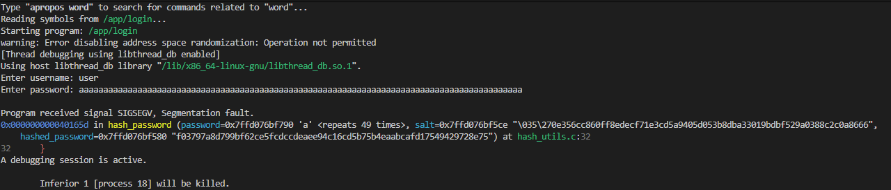
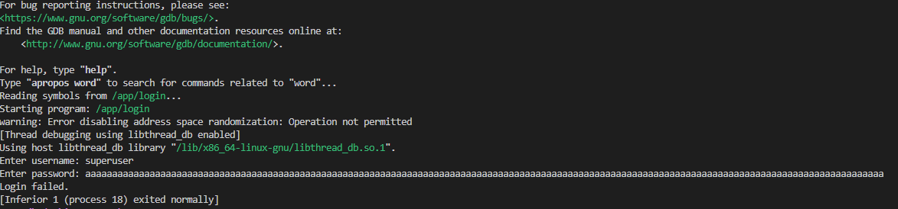

# Securing an Embedded System

This project focuses on analyzing and securing an embedded system architecture consisting of multiple devices connected to a central server. The system enables data collection and remote administrative control, including configuration updates and software management.

## Architecture Overview

The following diagram illustrates the system architecture:


## Getting Started

Instructions for how to get a copy of the project running on your local machine.

```bash
git clone https://github.com/onuroezcelik/securing_embedded_system.git
```

### Dependencies

No external dependencies are required for this project.

### Installation

Step by step explanation of how to get a dev environment running.

1. Clone the repository:

```bash
git clone https://github.com/onuroezcelik/securing_embedded_system.git
```

## Project Instructions

### STEP 1

### Simplified Threat Model

#### Identified Assets

The following assets were identified:
1. Collected Data – Data generated by devices and sent to the server
2. Device Firmware – Software running on the embedded devices
3. Administrative Interface – Communication channel used for device management

#### STRIDE Analysis
##### Asset 1: Collected Data

| Category        | Threat                     | Mitigation             |
| --------------- | -------------------------- | ---------------------- |
| Spoofing        | Fake device sends data     | Mutual authentication  |
| Tampering       | Data modified in transit   | TLS + integrity checks |
| Repudiation     | Device denies sending data | Logging + timestamps   |
| Info Disclosure | Data intercepted           | Encryption             |
| DoS             | Communication blocked      | Rate limiting          |

##### Asset 2: Device Firmware

| Category        | Threat                      | Mitigation                     |
| --------------- | --------------------------- | ------------------------------ |
| Spoofing        | Fake update server          | Server authentication          |
| Tampering       | Malicious firmware          | Signed firmware + secure boot  |
| Repudiation     | No update trace             | Update logs                    |
| Info Disclosure | Firmware extracted          | Secure storage + disable debug |
| DoS             | Broken update bricks device | Rollback mechanism             |
| Elevation       | Exploit gains control       | Least privilege + patching     |

##### Asset 3: Administrative Interface

| Category        | Threat                    | Mitigation                  |
| --------------- | ------------------------- | --------------------------- |
| Spoofing        | Fake server commands      | Mutual authentication       |
| Tampering       | Commands altered          | Encrypted channel           |
| Repudiation     | Admin denies action       | Audit logs                  |
| Info Disclosure | Credentials leaked        | Secure storage + encryption |
| DoS             | Admin interface blocked   | Rate limiting + monitoring  |
| Elevation       | Unauthorized admin access | RBAC                        |

Summary

Main risks include:

- unauthorized data injection
- data interception or modification
- malicious firmware updates
- abuse of admin interface

#### Key mitigations:

- authentication
- encryption
- secure firmware updates
- access control
- logging

### Step 2
#### User Role Matrix

Based on the architecture, the following roles and functions were identified.
The matrix follows the principle of least privilege, so each role only has the permissions necessary for its purpose.

| Role                     | View Collected Data | Change Data Collection Configuration | Perform Software Update | Disable Device |
| ------------------------ | ------------------- | ------------------------------------ | ----------------------- | -------------- |
| **Data Analyst**         | Yes                 | No                                   | No                      | No             |
| **System Administrator** | Yes                 | Yes                                  | Yes                     | Yes            |
| **Maintenance Operator** | No                  | No                                   | Yes                     | No             |

#### Role Description
1. **Data Analyst** can only access collected data for analysis purposes.
2. **System Administrator** has full administrative access to manage devices, update software, and disable devices when necessary.
3. **Maintenance Operator** can perform software updates but does not have access to collected data or other admin functions.

### Step 3 - Secure Handling of Sensitive Information

- Hardcoded credentials were removed from `login.c`
- Plaintext passwords were moved to a temporary `users.txt` file
- Credentials are stored as salted hashes in `hashed_users.txt`
- Login verifies passwords by hashing the input with the stored salt

1. **Hardcoded credentials removed from `login.c`**

   The following code is deleted from login.c
   ```c
   if (strcmp(username, "superuser") == 0 && strcmp(password, "h4rdc0d3d") == 0) {
       return 1;
   }
   ```
2. **Plaintext passwords in users.txt is updated.**

   User credentials were stored in plaintext, the hardcoded password in `login.c` is added to this file.
   ```
   user:password
   admin:s3CretP4ssword
   superuser:h4rdc0d3d
   ```
3. **Update login.c to use salt + hash**

   A) hash_utils.h is added

   B) Update the name of input file:
   ```
    #define FILE_USERS "hashed_users.txt"
   ```

   C) Parses a colon-separated line in the format username:salt_hex:stored_hash 
   and copies each field into its corresponding buffer if present.
   ```
   char* token = strtok(line, ":");
   if (token != NULL) {
      strcpy(file_username, token);
   
      token = strtok(NULL, ":");
      if (token != NULL) {
          strcpy(salt_hex, token);
   
          token = strtok(NULL, ":");
          if (token != NULL) {
              strcpy(stored_hash, token);
          }
      }
   }
   ```

   D) Verifies the entered username and password by matching the username
   and comparing the computed salted hash against the stored hash.
   ```
   if (strcmp(username, file_username) == 0) {
   
      unsigned char salt[2];
      char computed_hash[65];
      
      hex_to_bytes(salt_hex, salt, 2);
      
      // hash input password + salt
      hash_password(password, salt, computed_hash);
      
      // compare hashes (NOT plaintext)
      if (strcmp(computed_hash, stored_hash) == 0) {
          fclose(file);
          return 1;
      }
   }
   ```

4. **Update dockerfile**

   Compile the hash_utils.c and generate_hashed_users.c
   ```
   # Compile generator
   RUN gcc /app/generate_hashed_users.c /app/hash_utils.c -o /app/generate_hashed_users -lssl -lcrypto
   
   # Compile login program
   RUN gcc /app/login.c /app/hash_utils.c -o /app/login -lssl -lcrypto
   ```

5. **Update start.sh**

   Generate hashed users before login by adding:
   ```
   /app/generate_hashed_users
   ```

### Step 4

#### Buffer Overflow Vulnerability

A long password input was provided during login:



Result
- The program crashed with a segmentation fault (SIGSEGV).
- GDB reported the crash inside the hash_password function.
- The stack trace confirms memory corruption caused by the oversized input.

```
Program received signal SIGSEGV, Segmentation fault.
0x000000000040165d in hash_password (password=0x7ffd076bf790 'a' <repeats 49 times>, salt=0x7ffd076bf5ce "\035\270e356cc860ff8edecf71e3cd5a9405d053b8dba33019bdbf529a0388c2c0a8666", 
    hashed_password=0x7ffd076bf580 "f03797a8d799bf62ce5fcdccdeaee94c16cd5b75b4eaabcafd17549429728e75") at hash_utils.c:32
32      }
```

##### Buffer Overflow Fix

Fix 1: Increase Buffer Size
Increase the buffer to safely fit both salt and password:
```
char salted_password[SALT_LENGTH + MAX_PASSWORD_LENGTH];
```

Fix 2: Use a Safe Copy Function
Replace unsafe strcpy with a bounded copy:

```
strncpy(salted_password + SALT_LENGTH, password, MAX_PASSWORD_LENGTH - 1);
salted_password[SALT_LENGTH + MAX_PASSWORD_LENGTH - 1] = '\0';
```




### Step 5

### Step 6

### Step 7

## Built With

* [Item1](www.item1.com) - Description of item
* [Item2](www.item2.com) - Description of item
* [Item3](www.item3.com) - Description of item

Include all items used to build project.

## License
[License](../LICENSE.md)
