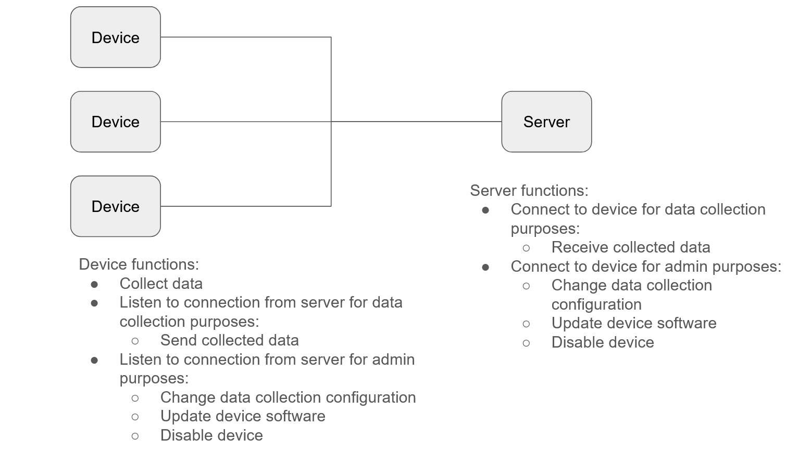

# Securing an Embedded System

This project focuses on analyzing and securing an embedded system architecture consisting of multiple devices connected to a central server. The system enables data collection and remote administrative control, including configuration updates and software management.

## Architecture Overview

The following diagram illustrates the system architecture:



## Getting Started

Instructions for how to get a copy of the project running on your local machine.

```bash
git clone https://github.com/onuroezcelik/securing_embedded_system.git
```

### Dependencies

No external dependencies are required for this project.

### Installation

Step by step explanation of how to get a dev environment running.

1. Clone the repository:

```bash
git clone https://github.com/onuroezcelik/securing_embedded_system.git
```

## Testing

Explain the steps needed to run any automated tests

### Break Down Tests

Explain what each test does and why

```
Examples here
```
## Project Instructions

### STEP 1

### Simplified Threat Model

#### Identified Assets

The following assets were identified:

Collected Data – Data generated by devices and sent to the server
Device Firmware – Software running on the embedded devices
Administrative Interface – Communication channel used for device management

STRIDE Analysis
Asset 1: Collected Data

| Category        | Threat                     | Mitigation             |
| --------------- | -------------------------- | ---------------------- |
| Spoofing        | Fake device sends data     | Mutual authentication  |
| Tampering       | Data modified in transit   | TLS + integrity checks |
| Repudiation     | Device denies sending data | Logging + timestamps   |
| Info Disclosure | Data intercepted           | Encryption             |
| DoS             | Communication blocked      | Rate limiting          |


Asset 2: Device Firmware

| Category        | Threat                      | Mitigation                     |
| --------------- | --------------------------- | ------------------------------ |
| Spoofing        | Fake update server          | Server authentication          |
| Tampering       | Malicious firmware          | Signed firmware + secure boot  |
| Repudiation     | No update trace             | Update logs                    |
| Info Disclosure | Firmware extracted          | Secure storage + disable debug |
| DoS             | Broken update bricks device | Rollback mechanism             |
| Elevation       | Exploit gains control       | Least privilege + patching     |


Asset 3: Administrative Interface

| Category        | Threat                    | Mitigation                  |
| --------------- | ------------------------- | --------------------------- |
| Spoofing        | Fake server commands      | Mutual authentication       |
| Tampering       | Commands altered          | Encrypted channel           |
| Repudiation     | Admin denies action       | Audit logs                  |
| Info Disclosure | Credentials leaked        | Secure storage + encryption |
| DoS             | Admin interface blocked   | Rate limiting + monitoring  |
| Elevation       | Unauthorized admin access | RBAC                        |

Summary

Main risks include:

unauthorized data injection
data interception or modification
malicious firmware updates
abuse of admin interface

Key mitigations:

authentication
encryption
secure firmware updates
access control
logging

### Step 2

### Step 3

### Step 4

### Step 5

### Step 6

### Step 7

## Built With

* [Item1](www.item1.com) - Description of item
* [Item2](www.item2.com) - Description of item
* [Item3](www.item3.com) - Description of item

Include all items used to build project.

## License
[License](../LICENSE.md)
