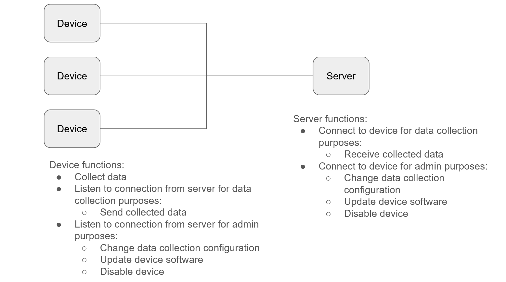
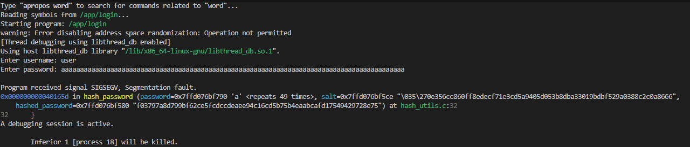
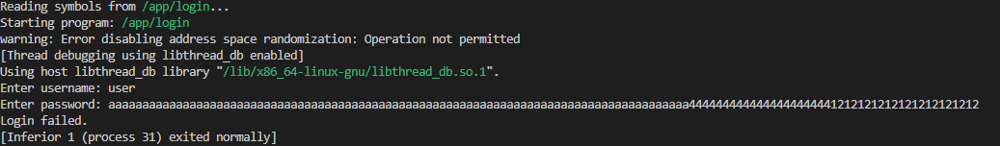

# Securing an Embedded System

This project focuses on analyzing and securing an embedded system architecture consisting of multiple devices connected to a central server. The system enables data collection and remote administrative control, including configuration updates and software management.

## Architecture Overview

The following diagram illustrates the system architecture:



## Getting Started

Instructions for how to get a copy of the project running on your local machine.

```bash
git clone https://github.com/onuroezcelik/securing_embedded_system.git
```

### Dependencies

The project relies on the following tools and libraries:

- Docker (for containerized client/server setup)
- OpenSSL (for TLS, certificate handling, and cryptographic operations)
- GCC (for compiling C programs)

## Project Instructions

## STEP 1 - Perform a simplified threat model

### Simplified Threat Model

#### Identified Assets

The following assets were identified:
1. Collected Data – Data generated by devices and sent to the server
2. Device Firmware – Software running on the embedded devices
3. Administrative Interface – Communication channel used for device management

#### STRIDE Analysis

##### Asset 1: Collected Data

| Category        | Threat                     | Mitigation             |
| --------------- | -------------------------- | ---------------------- |
| Spoofing        | Fake device sends data     | Mutual authentication  |
| Tampering       | Data modified in transit   | TLS + integrity checks |
| Repudiation     | Device denies sending data | Logging + timestamps   |
| Info Disclosure | Data intercepted           | Encryption             |
| DoS             | Communication blocked      | Rate limiting          |

##### Asset 2: Device Firmware

| Category        | Threat                      | Mitigation                     |
| --------------- | --------------------------- | ------------------------------ |
| Spoofing        | Fake update server          | Server authentication          |
| Tampering       | Malicious firmware          | Signed firmware + secure boot  |
| Repudiation     | No update trace             | Update logs                    |
| Info Disclosure | Firmware extracted          | Secure storage + disable debug |
| DoS             | Broken update bricks device | Rollback mechanism             |
| Elevation       | Exploit gains control       | Least privilege + patching     |

##### Asset 3: Administrative Interface

| Category        | Threat                    | Mitigation                  |
| --------------- | ------------------------- | --------------------------- |
| Spoofing        | Fake server commands      | Mutual authentication       |
| Tampering       | Commands altered          | Encrypted channel           |
| Repudiation     | Admin denies action       | Audit logs                  |
| Info Disclosure | Credentials leaked        | Secure storage + encryption |
| DoS             | Admin interface blocked   | Rate limiting + monitoring  |
| Elevation       | Unauthorized admin access | RBAC                        |

Summary

Main risks include:

- unauthorized data injection
- data interception or modification
- malicious firmware updates
- abuse of admin interface

#### Key mitigations:

- authentication
- encryption
- secure firmware updates
- access control
- logging

## Step 2 - Define user role matrix

**User Role Matrix:**

Based on the architecture, the following roles and functions were identified.
The matrix follows the principle of least privilege, so each role only has the permissions necessary for its purpose.

| Role                     | View Collected Data | Change Data Collection Configuration | Perform Software Update | Disable Device |
| ------------------------ | ------------------- | ------------------------------------ | ----------------------- | -------------- |
| **Data Analyst**         | Yes                 | No                                   | No                      | No             |
| **System Administrator** | Yes                 | Yes                                  | Yes                     | Yes            |
| **Maintenance Operator** | No                  | No                                   | Yes                     | No             |

**Role Description:**
1. **Data Analyst** can only access collected data for analysis purposes.
2. **System Administrator** has full administrative access to manage devices, update software, and disable devices when necessary.
3. **Maintenance Operator** can perform software updates but does not have access to collected data or other admin functions.

## Step 3 - Handling Sensitive Information

1. **Hardcoded credentials removed from `login.c`**

   The following code is deleted from login.c
   ```c
   if (strcmp(username, "superuser") == 0 && strcmp(password, "h4rdc0d3d") == 0) {
       return 1;
   }
   ```
2. **Plaintext passwords in users.txt is updated.**

   User credentials were stored in plaintext, the hardcoded password in `login.c` is added to this file.
   ```
   user:password
   admin:s3CretP4ssword
   superuser:h4rdc0d3d
   ```
3. **Update login.c to use salt + hash**

   **A) hash_utils.h is added**

   **B) Update the name of input file:**
   
   ```
    #define FILE_USERS "hashed_users.txt"
   ```

   **C) Parses a colon-separated line in the format username:salt_hex:stored_hash 
   and copies each field into its corresponding buffer if present.**
   
   ```
   char* token = strtok(line, ":");
   if (token != NULL) {
      strcpy(file_username, token);
   
      token = strtok(NULL, ":");
      if (token != NULL) {
          strcpy(salt_hex, token);
   
          token = strtok(NULL, ":");
          if (token != NULL) {
              strcpy(stored_hash, token);
          }
      }
   }
   ```

   **D) Verifies the entered username and password by matching the username
   and comparing the computed salted hash against the stored hash.**
   
   ```
   if (strcmp(username, file_username) == 0) {
   
      unsigned char salt[2];
      char computed_hash[65];
      
      hex_to_bytes(salt_hex, salt, 2);
      
      // hash input password + salt
      hash_password(password, salt, computed_hash);
      
      // compare hashes (NOT plaintext)
      if (strcmp(computed_hash, stored_hash) == 0) {
          fclose(file);
          return 1;
      }
   }
   ```

5. **Update dockerfile**

   Compile the hash_utils.c and generate_hashed_users.c
   
   ```
   # Compile generator
   RUN gcc /app/generate_hashed_users.c /app/hash_utils.c -o /app/generate_hashed_users -lssl -lcrypto
   
   # Compile login program
   RUN gcc /app/login.c /app/hash_utils.c -o /app/login -lssl -lcrypto
   ```

7. **Update start.sh**

   Generate hashed users before login by adding:
   ```
   /app/generate_hashed_users
   ```

## Step 4

### Buffer Overflow Vulnerability

A long password input was provided during login:



Result
- The program crashed with a segmentation fault (SIGSEGV).
- GDB reported the crash inside the hash_password function.
- The stack trace confirms memory corruption caused by the oversized input.

```
Program received signal SIGSEGV, Segmentation fault.
0x000000000040165d in hash_password (password=0x7ffd076bf790 'a' <repeats 49 times>, salt=0x7ffd076bf5ce "\035\270e356cc860ff8edecf71e3cd5a9405d053b8dba33019bdbf529a0388c2c0a8666", 
    hashed_password=0x7ffd076bf580 "f03797a8d799bf62ce5fcdccdeaee94c16cd5b75b4eaabcafd17549429728e75") at hash_utils.c:32
32      }
```

### Buffer Overflow Fix

**Fix 1: Increase Buffer Size**

Increase the buffer to safely fit both salt and password:
```
char salted_password[SALT_LENGTH + MAX_PASSWORD_LENGTH];
```

**Fix 2: Use a Safe Copy Function**

Replace unsafe strcpy with a bounded copy:

```
strncpy(salted_password + SALT_LENGTH, password, MAX_PASSWORD_LENGTH - 1);
salted_password[SALT_LENGTH + MAX_PASSWORD_LENGTH - 1] = '\0';
```

### Verification of Buffer Overflow Fix

After the fix:

- Long password inputs no longer cause crashes
- Program executes normally
- No memory corruption observed



### Lockout Mechanism Implementation

Features implemented in login.c:

**A) Failed login handling**

On each login attempt with wrong password:
The counter is incremented and the counter in "hashed_user.txt" file is updated via the function "update_counter(username, counter)".
After 3rd attempt, sleep(5) is triggered.
if the user is not found, it is also indicated with a warning, then the app exits. 

**B) Lockout policy**

If counter >= 3:
User is locked for 5 seconds by implementing the function sleep(5)
Further login attempts are blocked during this period

**C) Successful login reset**

On successful authentication:
Counter is reset to 0 and stored back in hashed_users.txt

```
if (strcmp(username, file_username) == 0) {

...

   if (strcmp(computed_hash, stored_hash) == 0) {
       fclose(file);
       update_counter(username, 0);
       return 1;
   }else{
       printf("number of failed attempt= %d\n", counter+1);
       counter++;
       update_counter(username, counter);
       if (counter >= 3){
           printf("Account locked. Try again in 5 seconds later.\n");
           sleep(5);
           fclose(file);
           return 0;
       }            
       fclose(file);
       return 0;
   }
}else{
   printf("User not found\n");
   fclose(file);
   return 0;
}
```

## Step 5

### Identify and disable legacy services

The container was built and executed using:

```
docker build -t project_step5 .
docker run -it --name step5 project_step5
```

A second terminal was used to access the container:

```
docker exec -it step5 /bin/bash
```

Network scanning was performed using:

```
nmap localhost
```

Result:

This indicates that the FTP service (proftpd) was active.

```
21/tcp open  ftp
```


To reduce the attack surface, all legacy services were removed from the Dockerfile:

Removed components:
- proftpd (FTP service)
- telnetd (Telnet service)
- openbsd-inetd
- xinetd

Related configuration files:
- xinetd.conf
- telnetd
- ftpd
- rlogind

Service startup commands:
- service xinetd start && /usr/sbin/proftpd

### Verification

After rebuilding and running the updated container:

A new scan was performed:

```
nmap localhost
```

Result:
All 1000 scanned ports are closed


### Remove Non-Production, Dead, and Unused Code

Findings

The source code contained:

- Hardcoded credentials (non-production backdoor)
- Unused functions
- Unreachable code

Actions Taken

Removed hardcoded login:

```
if (strcmp(username, "superuser") == 0 && strcmp(password, "h4rdc0d3d") == 0)
```

Removed unused functions:
- check_sensors()
- compare_values()
- debug_mode()

Removed unreachable code:

```
return 1;
check_sensors(); // never executed
```

### Functional Verification
Login functionality works correctly


## Step 6 - Establish secure communication.

The created files:
- rootCA.crt and rootCA.key
- server.key, server.csr, server.crt
- client.key, client.csr, client.crt

A file named output.txt is submitted which contains:
- the complete output from “openssl s_client -connect server:8443 -cert client.crt -key client.key” command executed from within the client container (showing the server certificate, handshake, TLSv1.3 being used, the received software update binary etc.).
- output from the command “cat received_update.bin |strings” including expected markers such as SOFTWAREUPDATE and CHECKSUM.

## Step 7 - Perform a secure software update.

A software update package was created containing the following components:

software_update.bin (update binary)
software_update.sig (digital signature)
software_update.checksum (SHA256 checksum)
software_update.crt (software update certificate)

The software update certificate was generated and signed by the Root CA, ensuring trust in the update source.

On the server side, the update binary was signed using the software update private key, and a SHA256 checksum was generated. All required files were then archived into a single software_package.zip, which was transmitted to the client.

On the client side, the received package was extracted and verified using a custom program (verify_update.c). The verification process includes:

- Validation of the software update certificate against the Root CA certificate
- Verification of the digital signature using the software update certificate
- Comparison of the SHA256 checksum to ensure file integrity

Only if all checks pass, the update is considered valid and accepted.


## License
This project is based on educational materials provided by Udacity.
The original content is licensed under the CC BY-NC-ND 4.0 license.
