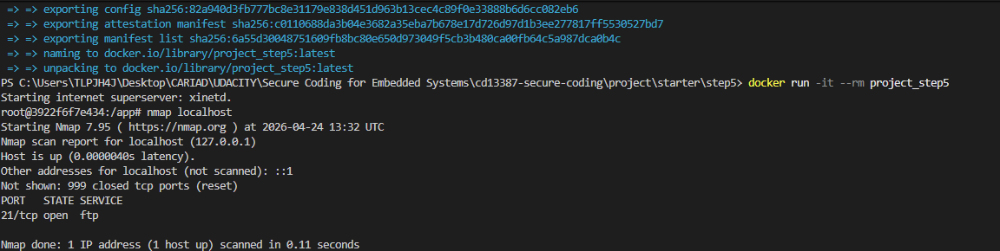
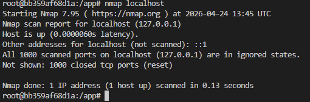
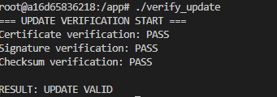

# Securing an Embedded System

This project focuses on analyzing and securing an embedded system architecture consisting of multiple devices connected to a central server. The system enables data collection and remote administrative control, including configuration updates and software management.

## Architecture Overview

The following diagram illustrates the system architecture:


## Getting Started

Instructions for how to get a copy of the project running on your local machine.

```bash
git clone https://github.com/onuroezcelik/securing_embedded_system.git
```

### Dependencies

The project relies on the following tools and libraries:

- Docker (for containerized client/server setup)
- OpenSSL (for TLS, certificate handling, and cryptographic operations)
- GCC (for compiling C programs)

## Testing
This project was developed and tested on a Windows environment using Docker.

## Project Instructions

## STEP 1 - Simplified Threat Model

### Identified Assets

The following assets were identified from the system architecture:
1. Server
2. Client Device
3. Update System

Asset 1: Server

| STRIDE Category | Threat | Mitigation |
|-----------------|--------|------------|
| Spoofing | An attacker impersonates a legitimate client device and connects to the server. | Use mutual authentication with certificates. |
| Tampering | An attacker modifies data or update files stored on the server. | Use integrity checks, access control, and signed files. |
| Repudiation | An administrator denies performing a system change or update action. | Use audit logs with timestamps and user identity. |
| Information Disclosure | Sensitive data stored on or transmitted by the server is exposed. | Use encryption in transit and restrict access to sensitive data. |
| Denial of Service | An attacker floods the server and prevents normal communication. | Use rate limiting, monitoring, and traffic filtering. |
| Elevation of Privilege | A low-privileged user gains administrative access to the server. | Apply least privilege, strong authentication, and patch vulnerabilities. |

Asset 2: Client Device

| STRIDE Category | Threat | Mitigation |
|-----------------|--------|------------|
| Spoofing | An attacker pretends to be a trusted server and sends commands to the device. | Verify the server certificate and use mutual TLS. |
| Tampering | An attacker modifies the firmware or configuration on the device. | Use secure boot, signed firmware, and integrity verification. |
| Repudiation | A user denies performing an action on the device. | Record device actions in logs with timestamps. |
| Information Disclosure | Sensitive data from the device is intercepted during communication. | Encrypt communication using TLS and protect stored secrets. |
| Denial of Service | An attacker sends excessive requests and makes the device unavailable. | Use rate limiting and input validation. |
| Elevation of Privilege | An attacker exploits a vulnerability to gain higher privileges on the device. | Use least privilege and secure coding practices. |

Asset 3: Update System

| STRIDE Category | Threat | Mitigation |
|-----------------|--------|------------|
| Spoofing | An attacker creates a fake update source or fake update package. | Sign updates and verify the signing certificate before installation. |
| Tampering | An attacker modifies the update package during transfer or storage. | Use digital signatures and checksum verification. |
| Repudiation | A sender denies creating or distributing a software update. | Keep signed update records and distribution logs. |
| Information Disclosure | An unauthorized party reads the update package contents. | Encrypt the update package if confidentiality is required. |
| Denial of Service | An attacker blocks update delivery or repeatedly sends invalid updates. | Validate updates before installation and reject untrusted packages. |
| Elevation of Privilege | A malicious update installs code that gives unauthorized control of the device. | Only allow authenticated and authorized signed updates. |

Summary:

The main risks in this architecture are device or server impersonation, firmware tampering, exposure of sensitive data, denial of service, and unauthorized privilege escalation.
The main mitigations are mutual authentication, encryption, signed updates, integrity verification, logging, access control, and least privilege.

## STEP 2 - Define user role matrix

**User Role Matrix**

The following user role matrix is based on the system architecture and follows the principle of least privilege. Each user account is only assigned the functions necessary for its role.

| User Account | Login | Update Software | View Data | Manage System |
|--------------|-------|-----------------|-----------|---------------|
| Admin        | Yes   | Yes             | Yes       | Yes           |
| User         | Yes   | No              | Yes       | No            |
| Client       | Yes   | Yes             | No        | No            |

Role Descriptions:
- Admin: Has full access to the system, including logging in, viewing data, performing software updates, and managing the system.
- User: Can log in and view data, but cannot update software or manage the system.
- Client: Can log in and perform software updates, but cannot view data or manage the system.

## STEP 3 - Handling Sensitive Information

Hardcoded credentials were removed from login.c by deleting the following code sections.

```c
if (strcmp(username, "superuser") == 0 && strcmp(password, "h4rdc0d3d") == 0) {
    return 1;
}
```

Plaintext passwords in users.txt were updated by adding the previously hardcoded credentials from login.c to the file.

```
user:password
admin:s3CretP4ssword
superuser:h4rdc0d3d
```

Update login.c to use salt + hash

- hash_utils.h is added.
- Update the name of input file.
   
   ```
    #define FILE_USERS "hashed_users.txt"
   ```

- Parses a colon-separated line in the format username:salt_hex:stored_hash and copies each field into its corresponding buffer if present.
   
   ```
   char* token = strtok(line, ":");
   if (token != NULL) {
      strcpy(file_username, token);
   
      token = strtok(NULL, ":");
      if (token != NULL) {
          strcpy(salt_hex, token);
   
          token = strtok(NULL, ":");
          if (token != NULL) {
              strcpy(stored_hash, token);
          }
      }
   }
   ```

- Verifies the entered username and password by matching the username and comparing the computed salted hash against the stored hash.
   
   ```
   if (strcmp(username, file_username) == 0) {
   
      unsigned char salt[2];
      char computed_hash[65];
      
      hex_to_bytes(salt_hex, salt, 2);
      
      // hash input password + salt
      hash_password(password, salt, computed_hash);
      
      // compare hashes (NOT plaintext)
      if (strcmp(computed_hash, stored_hash) == 0) {
          fclose(file);
          return 1;
      }
   }
   ```

Update dockerfile to compile the hash_utils.c and generate_hashed_users.c
   
```
# Compile generator
RUN gcc /app/generate_hashed_users.c /app/hash_utils.c -o /app/generate_hashed_users -lssl -lcrypto

# Compile login program
RUN gcc /app/login.c /app/hash_utils.c -o /app/login -lssl -lcrypto
```

Update start.sh to generate hashed users before login by adding:

```
/app/generate_hashed_users
```

## STEP 4 - Handling Input

### Buffer Overflow Vulnerability

A long password input was provided during login:


Result:
- The program crashed with a segmentation fault (SIGSEGV).
- GDB reported the crash inside the hash_password function.
- The stack trace confirms memory corruption caused by the oversized input.

```
Program received signal SIGSEGV, Segmentation fault.
0x000000000040165d in hash_password (password=0x7ffd076bf790 'a' <repeats 49 times>, salt=0x7ffd076bf5ce "\035\270e356cc860ff8edecf71e3cd5a9405d053b8dba33019bdbf529a0388c2c0a8666", 
    hashed_password=0x7ffd076bf580 "f03797a8d799bf62ce5fcdccdeaee94c16cd5b75b4eaabcafd17549429728e75") at hash_utils.c:32
32      }
```

### Buffer Overflow Fix

**Fix 1: Increase Buffer Size**

Increase the buffer to safely fit both salt and password:
```
char salted_password[SALT_LENGTH + MAX_PASSWORD_LENGTH];
```

**Fix 2: Use a Safe Copy Function**

Replace unsafe strcpy with a bounded copy:

```
strncpy(salted_password + SALT_LENGTH, password, MAX_PASSWORD_LENGTH - 1);
salted_password[SALT_LENGTH + MAX_PASSWORD_LENGTH - 1] = '\0';
```

### Verification of Buffer Overflow Fix

After the fix, the program executes normally


### Lockout Mechanism Implementation

Features implemented in login.c:

**A) Failed login handling**

On each login attempt with wrong password:
The counter is incremented and the counter in "hashed_user.txt" file is updated via the function "update_counter(username, counter)".
After 3rd attempt, sleep(5) is triggered.
if the user is not found, it is also indicated with a warning, then the app exits. 

**B) Lockout policy**

If counter >= 3:
User is locked for 5 seconds by implementing the function sleep(5)
Further login attempts are blocked during this period

**C) Successful login reset**

On successful authentication:
Counter is reset to 0 and stored back in hashed_users.txt

```
if (strcmp(username, file_username) == 0) {

...

   if (strcmp(computed_hash, stored_hash) == 0) {
       fclose(file);
       update_counter(username, 0);
       return 1;
   }else{
       printf("number of failed attempt= %d\n", counter+1);
       counter++;
       update_counter(username, counter);
       if (counter >= 3){
           printf("Account locked. Try again in 5 seconds later.\n");
           sleep(5);
           fclose(file);
           return 0;
       }            
       fclose(file);
       return 0;
   }
}else{
   printf("User not found\n");
   fclose(file);
   return 0;
}
```

## STEP 5

### Identify and disable legacy services

The container was built and executed using:

```
docker build -t project_step5 .
docker run -it --name step5 project_step5
```

A second terminal was used to access the container:

```
docker exec -it step5 /bin/bash
```

Network scanning was performed using:

```
nmap localhost
```

Result:

This indicates that the FTP service (proftpd) was active.

```
21/tcp open  ftp
```



To reduce the attack surface, all legacy services were removed from the Dockerfile:

Removed components:
- proftpd (FTP service)
- telnetd (Telnet service)
- openbsd-inetd
- xinetd

Related configuration files:
- xinetd.conf
- telnetd
- ftpd
- rlogind

Service startup commands:
- service xinetd start && /usr/sbin/proftpd

### Verification

After rebuilding and running the updated container:

A new scan was performed:

```
nmap localhost
```

Result:
All 1000 scanned ports are closed



### Remove Non-Production, Dead, and Unused Code

#### The source code contained:

- Hardcoded credentials (non-production backdoor)
- Unused functions
- Unreachable code

#### Actions Taken:

Removed hardcoded login:

```
if (strcmp(username, "superuser") == 0 && strcmp(password, "h4rdc0d3d") == 0)
```

Removed unused functions:
- check_sensors()
- compare_values()
- debug_mode()

Removed unreachable code:

```
return 1;
check_sensors(); // never executed
```

### Functional Verification
Login functionality works correctly

## STEP 6 - Establish secure communication.

The created files:
- rootCA.crt and rootCA.key
- server.key, server.csr, server.crt
- client.key, client.csr, client.crt

The file "output.txt" is submitted.

File location: step6/client/output.txt

It contains:
- output of the command `openssl s_client -connect server:8443 -cert client.crt -key client.key` executed inside the client container, showing:
  - server certificate
  - TLS 1.3 handshake
  - certificate validation process
  - received software update binary
- output of `cat received_update.bin | strings`, including SOFTWAREUPDATE and CHECKSUM markers

## STEP 7 - Perform a secure software update.

A software update package was created containing the following components:

software_update.bin (update binary)
software_update.sig (digital signature)
software_update.checksum (SHA256 checksum)
software_update.crt (software update certificate)

The software update certificate was generated and signed by the Root CA, ensuring trust in the update source.

On the server side, the software update binary was signed using the software update private key, a SHA256 checksum was generated, and all required files were packaged into a single software_package.zip for transmission to the client.

On the client side, the received package was extracted and verified using a custom program (verify_update.c). The verification process includes:

- Validation of the software update certificate against the Root CA certificate
- Verification of the digital signature using the software update certificate
- Comparison of the SHA256 checksum to ensure file integrity

Only if all checks pass, the update is considered valid and accepted.



## License
This project is based on educational materials provided by Udacity.
The original content is licensed under the CC BY-NC-ND 4.0 license.
